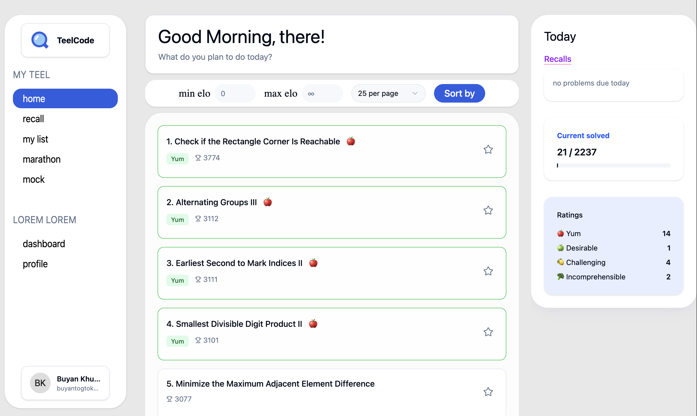
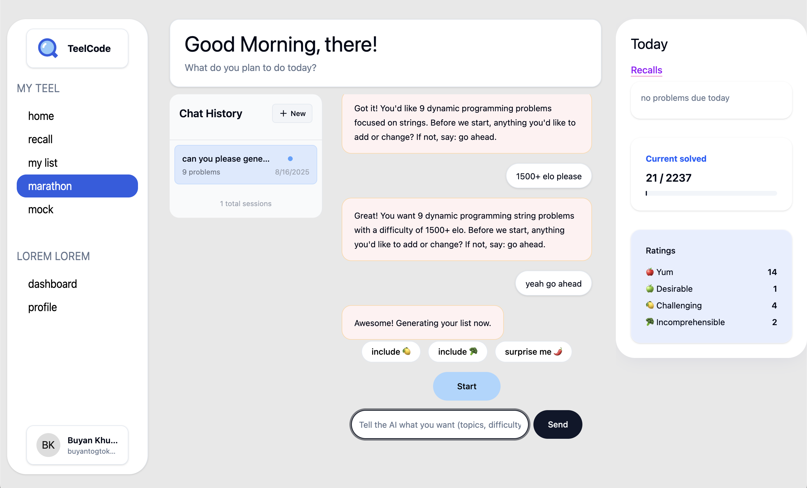

# TeelCode 🧠

**Live Demo: [https://teelcode.vercel.app/](https://teelcode.vercel.app/)**

A personalized LeetCode learning platform that helps you improve your coding skills through ELO-ranked problems and spaced repetition.

TeelCode contains **2800+ LeetCode problems** from every single contest, ranked in Codeforces-style ELO. This unique approach helps you climb the learning curve gradually and efficiently.

### Why I Built This

When I first started LeetCoding, I was immediately facing really hard problems far above my level. Trying to solve them while watching videos and trying to understand the code often left me burned out.

By solving problems ranked in ELO and climbing up, I found it was very efficient for my learning. I could feel myself getting better at different problems, I could feel my skills improving, my ELO going up.

This way, you can solve lots of problems and also move up slowly but steadily and surely.

I've solved around **150 problems** from this list, ranging from about **1200 ELO to 1700 ELO**. The progression is real and measurable!

## ✨ Key Features

### ELO-Ranked Problems

- **2800+ problems** from every LeetCode contest
- **Codeforces-style ELO ranking** for gradual skill progression
- Start from your level and climb steadily

### AI-Powered Marathons

Ask our AI to create custom problem marathon lists for you:

- _"Give me 15 DP + string problems over 1500 ELO"_
- _"Create a marathon of graph problems between 1300-1600 ELO"_
- Personalized learning paths based on your needs

### Smart Problem Rating System

Rate problems you've solved into 4 categories:

- **🍎 Apple** - Easy, well understood
- **🍏 Green Apple** - Good challenge, solid grasp
- **🍋 Lemon** - Challenging, needs review
- **🥦 Broccoli** - Incomprehensible, needs more work

### Spaced Repetition

Lemon and broccoli problems are automatically sent into a spaced repetition list:

- You'll be notified to solve them again in a few days
- This repeats until you graduate them (rate them apple or green apple)
- Ensures long-term retention and mastery

## Future Plans

### Browser Extension (Coming Soon)

- **Auto-detection**: Know if you've really solved the problem
- **Mistake analysis**: Identify wrong pitfalls you fell into
- **Smart hints**: Give a little nudge when you're stuck
- **Progress tracking**: Seamless integration with your solving process

### Built-in Compiler

- **Integrated environment**: Solve problems directly on the platform
- **Real-time feedback**: Immediate validation of your solutions
- **Learning analytics**: Track your solving patterns and improvements

##$ 🚀 Getting Started

1. Visit [https://teelcode.vercel.app/](https://teelcode.vercel.app/)
2. Sign up with your email
3. Start solving problems at your ELO level
4. Rate problems as you solve them
5. Use the AI marathon feature for targeted practice
6. Review lemon/broccoli problems in the spaced repetition system

### 🎯 The Learning Philosophy

**Gradual progression over brute force.** Instead of jumping into hard problems that demotivate you, start where you are and build up systematically. Your ELO will naturally reflect your true skill level, and you'll see measurable improvement over time.

---

**Built with ❤️ for the LeetCode community**
